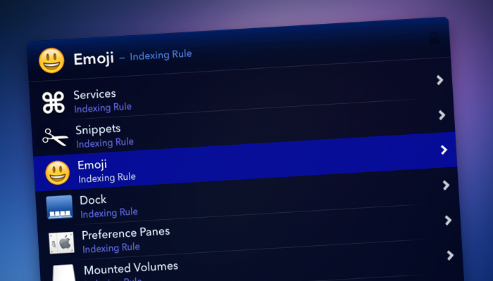
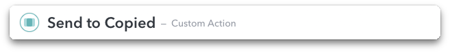

# LaunchBar Actions and Themes
My Repository of Actions and Themes for LaunchBar 6.


- [Application Reloader](#application-reloader)
     - [Download](#download)
- [Bluetooth Audio](#bluetooth-audio)
     - [Requirements](#requirements)
     - [Download](#download)
- [Date Convert](#date-convert)
     - [Download](#download)
- [Knock - Port Knocking](#knock---port-knocking)
     - [Requirements](#requirements)
     - [Define a sequence](#define-a-sequence)
     - [Download](#download)
- [LaunchBar Midnight Theme](#launchbar-midnight-theme)
     - [Download](#download)
- [Mac Promo Code](#mac-promo-code)
     - [Download](#download)
- [Proxy Switch](#proxy-switch)
     - [Installation](#installation)
     - [Define a proxy (UserProxy.json)](#define-a-proxy-userproxyjson)
     - [Download](#download)
- [Send to Copied](#send-to-copied)
     - [Installation](#installation)
     - [Download](#download)
- [Unique Identifier](#unique-identifier)
     - [Download](#download)


--------------------

##Application Reloader

Quit and restart passed Mac Application.

### Download
Reload Mac App: [ReloadApplication.lbaction](https://dl.dropboxusercontent.com/u/24409293/LaunchBar/ReloadApplication.lbaction)


--------------------

##Bluetooth Audio

List system paired Bluetooth Audio devices, connect and set system audio output. 


Press __[ALT] key__ to disconnect bluetooth device.

### Requirements

Install Switch Audio
[https://github.com/deweller/switchaudio-osx](https://github.com/deweller/switchaudio-osx)
```shell
    brew install switchaudio-osx
```

### Download
Bluetooth Audio Action: [BluetoothAudio.lbaction](https://dl.dropboxusercontent.com/u/24409293/LaunchBar/BluetoothAudio.lbaction)


--------------------

##Date Convert

Display date in __differents formats__ and convert _unix timestamp_ or date string. You can also __calculate an interval__, example: _+1d or -5h (h:hour, d:day, w:week, m:month)._

Press space bar to enter a date and __clicking on the date__ put content on the clipboard.


### Download
Date Convert Action: [DateConvert.lbaction](https://dl.dropboxusercontent.com/u/24409293/LaunchBar/DateConvert.lbaction)


--------------------

##Knock - Port Knocking

Knock server port with knock from LaunchBar

<!-- more -->


Install and launch ``Knock.lbaction`` and edit ``KnockList.json`` located in ``~/Library/Application Support/LaunchBar/Action Support/com.inspira.knock/``

__Tip:__ Press [ALT] key when you click on the action will display additional informations

### Requirements
Knock app in /usr/local/bin
```shell
brew install knock
```

### Define a sequence
* __title:__ LaunchBar menu title
* __subtitle:__ LaunchBar menu subtitle
* __server_ip:__ Server name or IP address
* __sequence:__ comma separated list
* __delay:__ delay in milliseconds between knock
* __app:__ name of the app to launch

```json
[
    {
    "title": "Raspberry",
    "server_ip": "192.168.0.50",
    "children": [
        {
            "title": "My knock command",
            "sequence": "5000:tcp,7000:tcp,6000:tcp",
            "delay": 300,
            "app":"MyAppToLaunch"
        },
        {
            "title": "...",
            "sequence": "..."
        }
    }
]
```
or a sequence at root :
```json
[
    {
        "title": "My knock command",
        "server_ip": "192.168.0.50",
        "sequence": "5000:tcp,7000:tcp,6000:tcp",
        "delay": 300,
        "app":"MyAppToLaunch"
    }
]
```

### Download
Knock Action: [Knock.lbaction](https://dl.dropboxusercontent.com/u/24409293/LaunchBar/Knock.lbaction)


--------------------

##LaunchBar Midnight Theme

Midnight Theme for LaunchBar



### Download
Midnight LaunchBar Theme: [Midnight.lbtheme](https://dl.dropboxusercontent.com/u/24409293/LaunchBar/Midnight.lbtheme)


--------------------

##Mac Promo Code

Open the Mac App Store application to redeem a promo code.

### Download
Mac Promo Code: [MacPromoCode.lbaction](https://dl.dropboxusercontent.com/u/24409293/LaunchBar/MacPromoCode.lbaction)


--------------------

##Proxy Switch

Display a list of user defined Proxy (json) and current status of Network Proxy Preferences (Ethernet).


### Installation
Install and launch ``ProxySwitch.lbaction`` and edit ``UserProxy.json`` located in ``~/Library/Application Support/LaunchBar/Action Support/com.inspira.proxyswitch/``

Action retrieve the __admin password__ from __Keychain__. Open Keychain app and add a new Generic Password named ```ProxySwitch```

__Tip:__ Press [ALT] key when you click on the action will display the "Action Support" Folder


### Define a proxy (UserProxy.json)
* __title:__ Proxy Title.
* __subtitle:__ Additional information.
* __proxy_ip:__ IP Address.
* __proxy_port:__ Port number.
* __proxy_type:__ Type : web, https, ftp or socks.
* __app:__ Application name or path to launch.

### Download
Switch Proxy Action: [ProxySwitch.lbaction](https://dl.dropboxusercontent.com/u/24409293/LaunchBar/ProxySwitch.lbaction)


--------------------

##Send to Copied

Send Image or Text to Copied app [copiedapp.com](http://copiedapp.com/).



### Installation
Doucle-click on ``SendToCopied.lbaction`` to install and:

* Send Text or Image file with **LaunchBar Instant Send** to "Send to Copied" action.
* Press space to Enter text to copy.
* Press enter to choose an Image file to send to Copied.

### Download
Send to Copied: [SendToCopied.lbaction](https://dl.dropboxusercontent.com/u/24409293/LaunchBar/SendToCopied.lbaction)


--------------------

##Unique Identifier

Generate a 12 characters unique identifier.

### Download
UniqID Action: [UniqID.lbaction](https://dl.dropboxusercontent.com/u/24409293/LaunchBar/UniqID.lbaction)

