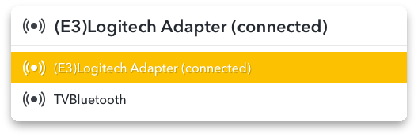
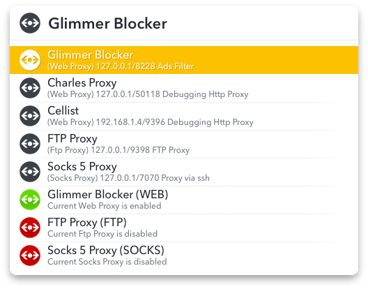
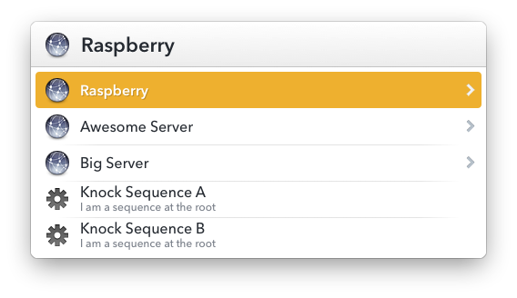
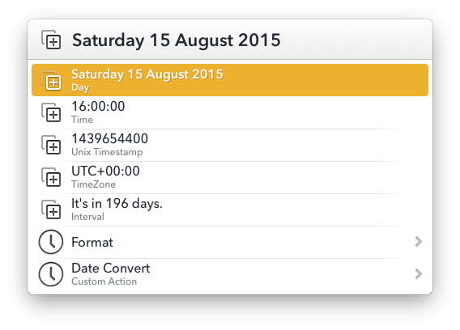

# LaunchBar Actions Repo
My Actions repository for LaunchBar 6 

* [Bluetooth Audio](#bluetoothaudio) 
* [Proxy Switch](#proxyswitch) 
* [Knock](#knock) 
* [Date Convert](#dateconvert) 

---

**21 octobre 2015 Update** 

* Actions modified to use the **update system** from [Padraic Renaghan Actions](http://prenagha.github.io/launchbar/updates.html)
* **Re-install all actions manually** and **install [Updates.lbaction](https://dl.dropboxusercontent.com/u/1094926/lbdist/Updates.lbaction)** to stay up-to-date later.
* Changed the **Bundle ID** of all actions, **move your existing JSON configurations files** to the new bundle folder of each action : `~/Library/Application Support/LaunchBar/Action Support/`


<a name="bluetoothaudio"></a>
## Bluetooth Audio

List system paired Bluetooth Audio devices, connect and set system audio output. 



Press __[ALT] key__ to disconnect bluetooth device.

### Requirements

Install Switch Audio
[https://github.com/deweller/switchaudio-osx](https://github.com/deweller/switchaudio-osx)
```shell
    brew install switchaudio-osx
```

### Download
Bluetooth Audio Action: [BluetoothAudio.lbaction](https://dl.dropboxusercontent.com/u/24409293/LaunchBar/BluetoothAudio.lbaction)

---

<a name="proxyswitch"></a>
## Proxy Switch

Display a list of user defined Proxy (json) and current status of Network Proxy Preferences (Ethernet).



### Installation
Install and launch ``ProxySwitch.lbaction`` and edit ``UserProxy.json`` located in ``~/Library/Application Support/LaunchBar/Action Support/com.agonia.proxyswitch/``

Action retrieve the __admin password__ from __Keychain__. Open Keychain app and add a new Generic Password named ```ProxySwitch```

__Tip:__ Press [ALT] key when you click on the action will display the "Action Support" Folder


### Define a proxy (UserProxy.json)
* __title:__ Proxy Title.
* __subtitle:__ Additional information.
* __proxy_ip:__ IP Address.
* __proxy_port:__ Port number.
* __proxy_type:__ Type : web, https, ftp or socks.
* __app:__ Application name or path to launch.

### Download
Switch Proxy Action: [ProxySwitch.lbaction](https://dl.dropboxusercontent.com/u/24409293/LaunchBar/ProxySwitch.lbaction)

---

<a name="knock"></a>
## Knock : Port Knocking
Knock server port with knock from LaunchBar



Install and launch ``Knock.lbaction`` and edit ``KnockList.json`` located in ``~/Library/Application Support/LaunchBar/Action Support/com.agonia.knock/``

__Tip:__ Press [ALT] key when you click on the action will display additional informations

### Requirements
Knock app in /usr/local/bin
```shell
brew install knock
```

### Define a sequence
* __title:__ LaunchBar menu title
* __subtitle:__ LaunchBar menu subtitle
* __server_ip:__ Server name or IP address
* __sequence:__ comma separated list
* __delay:__ delay in milliseconds between knock
* __app:__ name of the app to launch

```json
[
    {
    "title": "Raspberry",
    "server_ip": "192.168.0.50",
    "children": [
        {
            "title": "My knock command",
            "sequence": "5000:tcp,7000:tcp,6000:tcp",
            "delay": 300,
            "app":"MyAppToLaunch"
        },
        {
            "title": "...",
            "sequence": "..."
        }
    }
]
```
or a sequence at root :
```json
[
    {
        "title": "My knock command",
        "server_ip": "192.168.0.50",
        "sequence": "5000:tcp,7000:tcp,6000:tcp",
        "delay": 300,
        "app":"MyAppToLaunch"
    }
]
```

### Download
Knock Action: [Knock.lbaction](https://dl.dropboxusercontent.com/u/24409293/LaunchBar/Knock.lbaction)

---

<a name="dateconvert"></a>
## Date Convert

Display date in __differents formats__ and convert _unix timestamp_ or date string. You can also __calculate an interval__, example: _+1d or -5h (h:hour, d:day, w:week, m:month)._

Press space bar to enter a date and __clicking on the date__ put content on the clipboard.



### Download
Date Convert Action: [DateConvert.lbaction](https://dl.dropboxusercontent.com/u/24409293/LaunchBar/DateConvert.lbaction)

---


